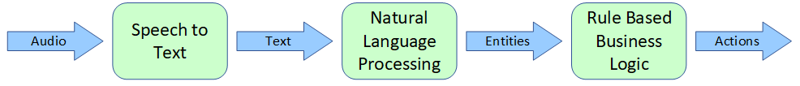
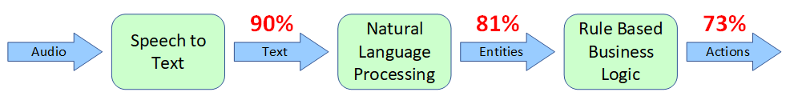
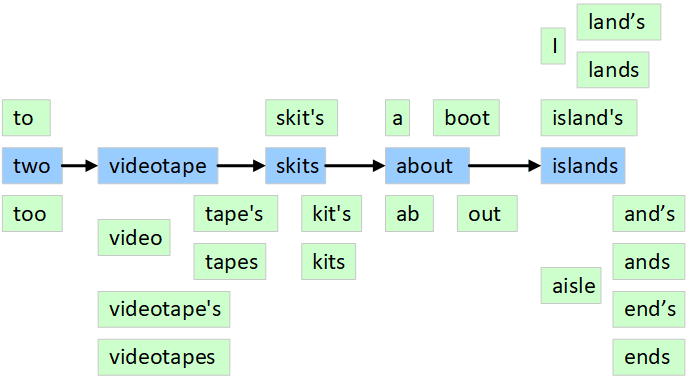
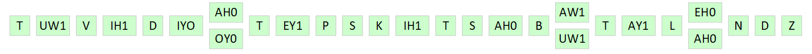
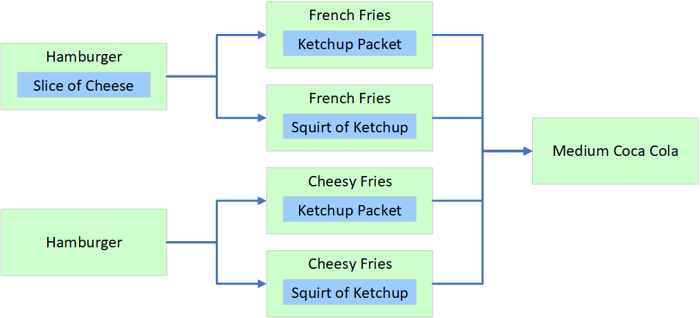

# Mitigating Errors in Speech-to-Text Systems

A common architecture for speech-based conversational agents is a three stage pipeline, where speech is first converted to text, which is then passed to an NLP algorithm that extracts entities, intents, and sentiments, which are then passed to a rules-based system which performs actions.

This pipelined approach has a fundamental weakness that 
limits the effectiveness of the system as a whole.
The problem is that _each stage must commit to an interpretation of its input in isolation and without context from the other stages_. Once a stage commits to an interpretation, all subsequent stages must live with the interpretation, even if there were other plausible interpretations.

This might not seem like a serious limitation, but consider a system with three stages, each of which gets the correct interpretation 90% of the time. If the errors in the stages are uncorrelated, then the second stage will be right 81% of the time and the third stage will succeed 73% of the time.

In domains with low error rates, this sort of compounding might be tolerable, but the domain of human speech is notoriously difficult. Even if you factor out the impact of differences in voice, accent, culture and speaking style, you are still faced with understanding a language that is inherently ambiguous.

## A Better Way

The challenge with the pipeline approach is that each stage must _commit to a single interpretation of its input_, and it must do this in a _highly ambiguous environment_ without access to _context from subsequent stages_.

One solution is to avoid making decisions until the end of the pipeline.
Instead of settling on _one interpretration_, each stage can forward _the set of all possible interpretations_.

Consider, for example, the speech-to-text module. Suppose its input sounds like the phrase,
~~~
"too videotape's kits about aisle ends"
~~~
In the traditional pipeline, the speech stage could forward this interpretation along, when the following might be more correct:
~~~
"two videotape skits about islands"
~~~

A stage can avoid committing to a single interpretation by generating a graph the represents all possible interpretations. The following diagram shows all the words in a hypothetical lexicon that sound like portions of the input phrase. Paths from left to right represent possible interpretations. In this case, the blue path represents one of the better interpretations.

Other paths through the graph represent less likely interpretations, such as
~~~
to videotape's kits about aisle ends
two videotape skit's a boot I land's
too video tapes kit's aobut aisle and's
~~~

If the speech-to-text stage forwarded only the blue path, subsequent stages would not have access to these less likely, but potentially valid, interpretations.

In generating this graph of words, the speech-to-text module still commits to decisions the sounds of words in the lexicon. It could avoid these decisions, altogether, by forwarding a graph of phonemes, rather than words. Here's a graph of phonemes that sound like `"two videotape skits about islands"`:

This graph-based approach _requires a completely different type of Natural Language Processor_ because it must accept a graph as input, instead of a string of characters. The graph might be composed of words from the lexicon, or it might be made up of phonemes or other sound-based encodings.

In a similar manner, the natural lauguage processor can generate a graph of compount entities. Suppose the input text was `"burger with cheese fries and ketchup and a coke"`. Does this refer to a `cheeseburger` with `fries` or a `plain hamburger` with `cheesy fries`? We can let the business logic sort this out by forwarding a graph of potential compound entities:

In this graph, the term `cheese` might be part of the `hamburger` compound entity or it might be part of the name of the `cheesy fries` product. The term `ketchup` might refer to a `packet of ketchup`, or a squirt of the `ketchup ingrdient`.

Given this graph, the business logic may be able to prune some paths. As an example, the ketchup ingredient, `squirt of ketchup` might only be allowed on the `hamburger`, while the `ketchup packet` may be the only form allowed with `french fries`. Likewise, `slice of cheese` may not be allowed on the hamburger, meaning that the term, `cheese` must be part of `cheesy fries`.

Again, the graph-based approach requires a completely different type of Business Logic that can accept a graph as input and reason about the legality and value of each of the paths.

## Retrofitting Legacy Systems

Popular commercial speech recognition systems tend to return a single interpretation instead of a graph of possibilities. On idea for retrofitting:
1. Speech recognition system generates one interpretation
1. Convert interpretation into graph of phonemes. Graph will have multiple paths because some words have multiple pronounciations (e.g. `"bow"`).
1. Use fuzzy matcher against phoneme graph to generate graph of words from the lexicon, or just return the phoneme graph.

Commerial NLU systems do a bit better. Are often feature detectors. Features can sometimes be arranged into a graph.

## Sources of Ambiguity in Speech-to-Text Systems
Let's look at a few of the sources of ambiguity in speech-to-text systems. Probably the most common source of ambiguity is from [homonyms](https://en.wikipedia.org/wiki/Homonym). These are words that sound the same, but have different meanings. For example,
~~~
for, four
two, to, too
why's, wise, y's
fare, fair
caught, cot
know, no
knight, night
knot, not
sail, sale
vale, vail
none, nun
~~~
One common form of homonym ambiguity is distinguishing the plural from the possessive:
~~~
lands, land's
~~~

Speech-to-text systems also struggle with word-segmentation. Where does one word end and the next begin?
The following example shows alternative segementations of three phrases:
~~~
videotape skits
video tapes kits

island
aisle and
i land

engineering
engine earring
~~~

Speech-to-text systems often use machine learning to reduce ambiguity by considering each interpretation in the context of its surrounding words. This approach has a number of limitations.

The first is that it relies on the surrounding text to provide sufficient context to disambiguate competing interpretations. In many real-world scenarios, the phrases are too short to provide this context.
In some cases, one may have context from earlier in the conversation, but in practice, many speech-to-text systems are stateless, RESTful systems that only consider the current utterance.

The second problem is that the system must be trained for the context in which it will be used. Many organizations are unable to provide sufficient training data and don't possess the skills to perform the training and evaluate its effectiveness. 

In some scenarios, the training data changes over time, as new products are introduced and the system is rolled out in new environments. These system require continuous training along with the rigor and processes to ensure that successive versions of the system don't regress working functionality.

### Sources of Errors and Ambiguity in NLP Systems

The world of natural language understanding has its own set of ambiguities.

**Name inside name**

~~~
"I'd like a coffee with a half and half"

INTENT(ORDER)         : I'd like
QUANTITY(1)           : a
ENTITY(COFFEE)        : coffee
CONJUNCTION           : with
QUANTITY(1)           : a
ENTITY(HALF AND HALF) : half and half

INTENT(ORDER)         : I'd like
QUANTITY(1)           : a
ENTITY(COFFEE)        : coffee
CONJUNCTION           : with
QUANTITY(1/2)         : a half
CONJUNCTION           : and
UNKNOWN               : half
~~~

**Segmentation**

~~~
"I'd like a burger with cheese fries and a coke"

burger
  add cheese
fries
coke

burger
cheese fries
coke
~~~

**Segmentation into Compound Entities**

~~~
"I'd like a grande latte iced tea and a muffin""

grande iced latte
tea
muffin

grande latte
iced tea
muffin
~~~

**Segmentation into Compound Entities**

~~~
"I'd like an iced tea latte and a muffin"

iced tea latte
muffin

iced tea
latte
muffin
~~~

~~~
"i'd like a burger with ketchup and fries with ketchup"

burger
  add ketchup
fries
ketchup packet
~~~

## A Better Approach
given that STT systems are error-prone

-----

~~~
troops troop's troupes troupe's
knows no's nose noes
~~~

 and that is that 
overall effectiveness of the system.
forced to commit to an interpretation without context
errors compund
The very structure of the pipelined architecture 
One approach to speech-based conversational agents

### Homonyms, Homophones, Homographs

Plural vs possessive
~~~
lands land's
~~~

bow bow

### Segmentation Errors

~~~
videotape skits
video tapes kits

engineering
engine earring

island
aisle and
i land

i found the miscount surprising
i found the mis counts uprising
~~~

## Phonetic Algorithms

### Soundex
### Metaphone and Double Metaphone
### Pronunciation Dictionaries
CMU
Wiktionary

### Random Stuff
without access to context from successive stages. In a highly ambiguous environment, it is easy to pick an interpretation which will ultimately turn out to be incorrect.
~~~
two videotape skits about islands

T UW1   V IH1 D IY0 OW0 T EY1 P   S K IH1 T S   AH0 B AW1 T   AY1 L AH0 N D Z
tu  ˈvɪdɪˌoʊteɪ̯p ˈskɪts əˈbaʊt ˈaɪ̯lənds
~~~

